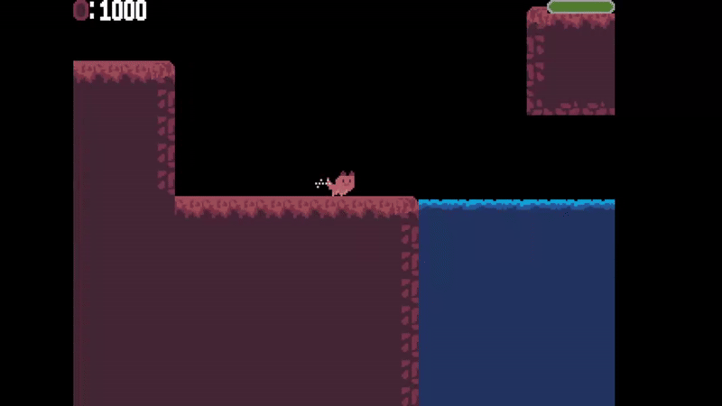
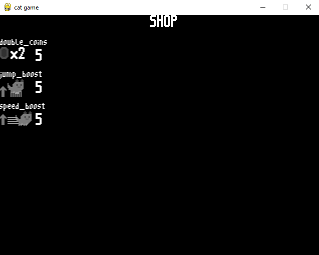

# Platformer Game

A small 2D platformer game created with **Python and Pygame**, focusing on custom game systems such as enemy AI, combat mechanics and level loading.

This project was developed as a personal learning project to explore game architecture, physics, collision handling, and real-time system design.

All code, logic, and graphics were created by me.

---

## Features

## Core Gameplay

- Player movement with gravity, jumping and collision handling
- Camera scrolling with screen shake for impact feedback
- Respawn system

## Enemies & Combat
- Modular enemy system with shared base logic
- Multiple enemy types: 
  - Patroller (horizontal Movement)
  - Chaser (aggressive behavior when close)
  - Shooter (projectile-based attacks)
- Player ↔ enemy damage system
- Projectile system with lifetime and collision handling
-Visual hit feedback on damage

## Levels & Progression
- JSON-based level loader (work in progress)
- Basic level structure with spawn points
- In-game shop with upgrades:
  - jump boost
  - speed boost
  - double coins

---

## Screenshots



---

## Tech Stack

- Python
- Pygame

---

## Installation

Make sure Python is installed, then install pygame:

```bash
pip install pygame
```
---

## Run

```bash
python main.py
```

---

## What I learned

- Designing and managing a custom game loop
- Implementing physics and collision systems without a game engine
- State- and timer-based gameplay logic (enemy AI, damage handling)
- Structuring and refactoring a growing Python codebase
- Separating game logic, assets, and data (JSON-based levels)
- Debugging real-time systems and gameplay bugs

## Planned Improvements

- Checkpoints and level transitions
- UI menus (pause, game over, win screen)
- Save/load system
- Audio system (sound effects and music)
- Further enemy behaviors and polish