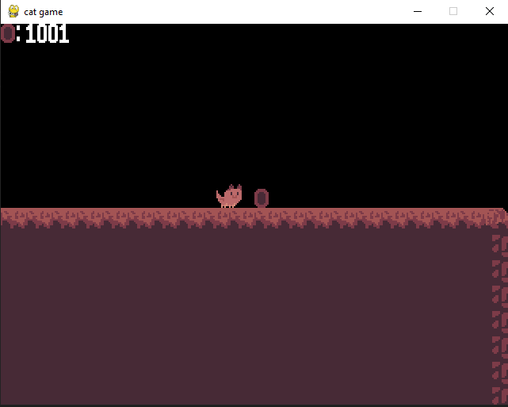

# Platformer Game

A small 2D platformer game created with **Python and Pygame**.

This project was developed as a personal learning project to better understand game logic, physics, and collision systems.

All code, logic, and graphics were created by me.

---

## Features

- Player movement (left / right)
- Jump mechanics
- Gravity and falling
- Collision detection
- Respawn system
- Basic level layout
- In-game shop with upgrades:
  - jump boost
  - speed boost
  - double coins

---

## Screenshots




---

## Tech Stack

- Python
- Pygame

---

## Installation

Make sure Python is installed, then install pygame:

```bash
pip install pygame
```
---

## Run

```bash
python main.py
```

---

## What I learned

- Game loops and frame-based updates
- Collision detection systems
- Player physics (gravity, jumping)
- Structuring larger Python projects
- Debugging complex logic