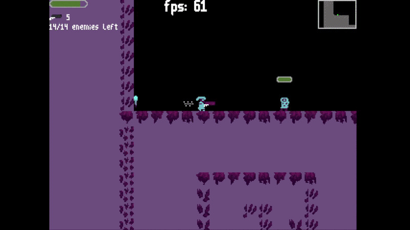
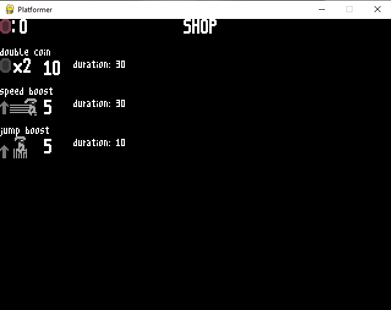

# Platformer Game

A 2D platformer built in **Python using Pygame**, focused on implementing custom game systems such as entity management, real-time physics, and modular AI behavior.

This project emphasizes **architecture, performance considerations, and clean system design**, without relying on an external game engine.

All code, logic, and graphics were created by me.

---

## 🎮 Features

### Core Gameplay

* Player movement with gravity, jumping, and collision handling
* Camera scrolling with screen shake for impact feedback
* Respawn system

### Enemies & Combat

* Modular enemy system with shared base logic
* Multiple enemy types:

  * **Patroller** (horizontal movement)
  * **Chaser** (aggressive pursuit behavior)
  * **Shooter** (projectile-based attacks)
* Player ↔ enemy damage system
* Projectile system with lifetime and collision handling
* Visual hit feedback on damage

### Levels & Progression

* JSON-based level loader
* Spawn points and structured level data
* In-game shop with upgrades:

  * Jump boost
  * Speed boost
  * Double coins

---

## 🧠 Architecture

The game is structured around a central game loop and modular subsystems:

* **Game class** coordinating rendering, input, and updates
* **Entity system** for player and enemies with shared base logic
* **Enemy manager** handling AI behavior and updates
* **Level system** driven by JSON configuration files
* **Rendering system** with camera scrolling and screen shake

The project was **heavily refactored** to reduce coupling and improve maintainability as complexity increased.

---

## ⚡ Performance Considerations

* View-based rendering (only nearby tiles are drawn)
* Optimized update loops for entities and projectiles
* Reduced unnecessary computations in the main game loop

---

## 📸 Screenshots




---

## 🛠 Tech Stack

* Python
* Pygame

---

## 🚀 Installation

Make sure Python is installed, then install dependencies:

```bash
pip install pygame-ce
```

---

## ▶️ Run

```bash
python main.py
```

---

## 🎯 Motivation

This project was built to gain a deeper understanding of how real-time systems work under the hood, including game loops, entity management, and performance constraints.

---

## 📚 What I learned

* Designing and structuring real-time systems
* Building a custom game loop and entity system
* Implementing physics and collision handling without a game engine
* Refactoring to reduce coupling and improve maintainability
* Managing game state and timing logic
* Debugging complex real-time interactions

---

## 🔮 Planned Improvements

* Checkpoints and level transitions
* UI menus (pause, game over, win screen)
* Save/load system
* Audio system (sound effects and music)
* Additional enemy behaviors and polish
