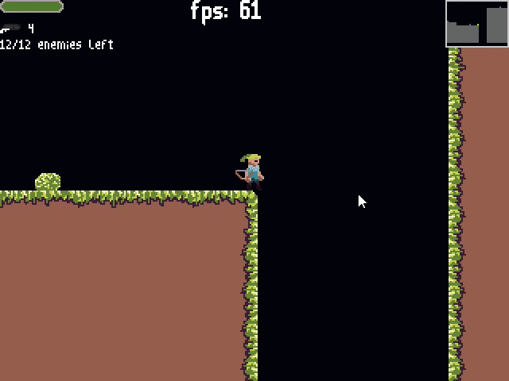
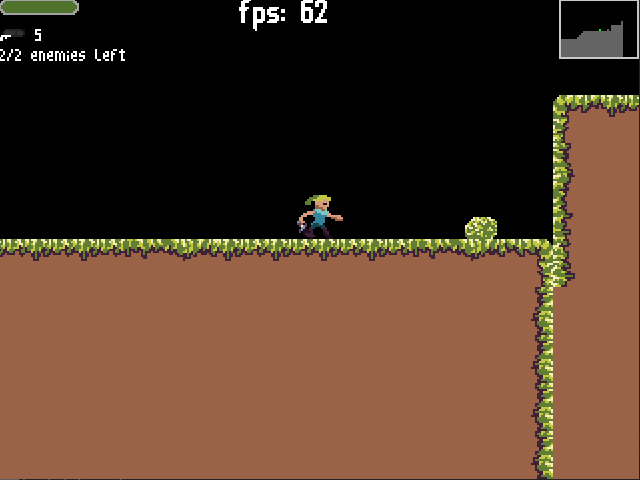
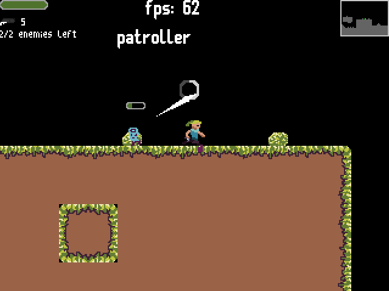
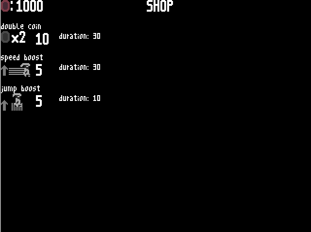
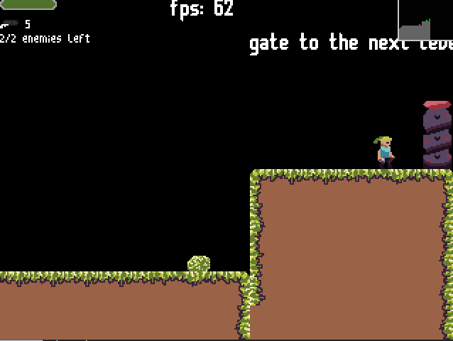
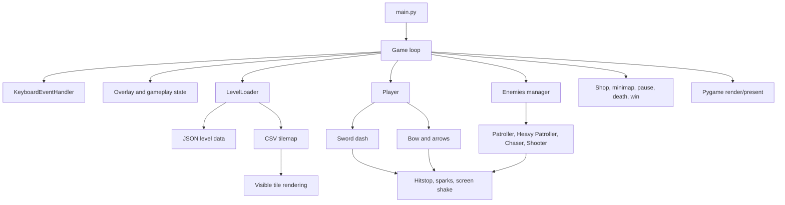

# Sparkbound

[](https://github.com/IramiJ/sparkbound/actions/workflows/format_and_test.yml)
[](https://www.python.org/downloads/)
[](LICENSE)

Sparkbound is a fast 2D action-platformer where a sword-and-bow adventurer fights from open wilds into a dungeon, chaining arrows, sword dashes, upgrades, and hit sparks to defeat strange enemies blocking the way.

Built in Python with pygame-ce, Sparkbound is a solo project focused on custom real-time game systems, modular entity architecture, deterministic gameplay logic, and measurable performance work without using an external game engine.



## Download

[Download Sparkbound for Windows](https://github.com/IramiJ/platformer/releases/latest/download/Sparkbound.exe)

No Python installation is required.

## Project Status

Sparkbound is a playable portfolio build with level transitions, combat, enemy AI, shop upgrades, pause/death/win overlays, minimap rendering, profiling, and automated tests in place.

| Item | Status |
| --- | --- |
| Development period | September 2022 to August 2026, based on git history |
| Role | Solo developer |
| Responsibilities | Gameplay programming, custom game loop, entity systems, enemy AI, combat, level loading, UI, tests, profiling, documentation, and project-local pixel art |
| Current version | `1.0.0` in `pyproject.toml` |
| License | MIT License |

## License and Ownership

Sparkbound is open source under the [MIT License](LICENSE). You can use, copy, modify, distribute, and build on the project freely as long as the license notice is included.

All included game assets, including the pixel art, sprites, tiles, UI graphics, and visual effects, were drawn by the project author and are included under the same MIT License unless a file states otherwise.

The code was primarily written by the project author. AI tools were used as an assistant during development for code-writing support, refactoring ideas, and iteration.

## Features

### Combat and Movement

- Sword dash attacks with hitstop, healing on contact, cooldown feedback, and spark effects.
- Ranged bow mode with arrows, ammo, reload timing, enemy stun, and projectile cleanup.
- Fast platformer movement with gravity, jumping, dashing, collision resolution, respawns, checkpoints, and screen shake.
- Mode switching between melee and ranged combat so sword dashes and arrows can be combined.

### Enemies and Progression

- Modular enemy registry with Patroller, Heavy Patroller, Chaser, and Shooter enemy types.
- Active-range enemy updates so distant enemies stay inexpensive until the player approaches.
- Coin rewards for defeated enemies, including a double-coin shop buff.
- Three JSON-driven levels with validated level data, rectangular exits, level transitions, and a final win state.

### UI and World Systems

- In-game shop with speed boost, jump boost, and double coin upgrades.
- Pause, death, and win overlays that pause only the intended game systems.
- Minimap with boundary-safe reads.
- Camera scrolling, tile culling, torch/chandelier props, foliage, sword particles, and HUD rendering.

### Engineering and Quality

- Importable production modules with an `if __name__ == "__main__"` entry point.
- Consistent seconds-based delta time for movement, cooldowns, buffs, hitstop, particles, and animation.
- Validated level, tilemap, keybind, shop, enemy, and asset data.
- Automated tests for startup, coordinates, collisions, level validation, level transitions, minimap boundaries, projectiles, shop/buffs, resets, and profiling.
- Ruff formatting/linting and a GitHub Actions workflow for Python 3.12.

## Screenshots

| Movement | Combat |
| :---: | :---: |
|  |  |

| Shop | Level transition |
| :---: | :---: |
|  |  |

## Controls

Keybinds are loaded from [`core/keybinds.json`](core/keybinds.json).

| Action | Input |
| --- | --- |
| Move left/right | Left Arrow / Right Arrow |
| Jump | Space |
| Switch sword/bow mode | R |
| Sword dash attack | E while in melee mode |
| Shoot arrow | Q while in ranged mode |
| Reload bow | D while in ranged mode |
| Open/close shop | B |
| Buy shop item | Left mouse click in the shop |
| Pause/resume | Escape |
| Respawn after death | Press any key |

## Architecture


```mermaid
flowchart TD
    Entry["main.py"] --> Game["Game loop"]
    Game --> Input["KeyboardEventHandler"]
    Game --> State["Overlay and gameplay state"]
    Game --> Level["LevelLoader"]
    Game --> Player["Player"]
    Game --> Enemies["Enemies manager"]
    Game --> UI["Shop, minimap, pause, death, win"]
    Game --> Render["Pygame render/present"]

    Level --> LevelData["JSON level data"]
    Level --> Tilemap["CSV tilemap"]
    Tilemap --> Culling["Visible tile rendering"]

    Player --> Sword["Sword dash"]
    Player --> Bow["Bow and arrows"]
    Enemies --> AI["Patroller, Heavy Patroller, Chaser, Shooter"]
    Sword --> Effects["Hitstop, sparks, screen shake"]
    Bow --> Effects
    AI --> Effects
```

Representative code:

- Game loop and runtime coordination: [`main.py`](main.py)
- Level loading, validation, transitions, and checkpoints: [`world/level_loader.py`](world/level_loader.py)
- Enemy registry and update lifecycle: [`entities/enemies/enemies.py`](entities/enemies/enemies.py)
- Player sword/bow composition and movement: [`entities/player/player.py`](entities/player/player.py)
- Collision resolution: [`world/collisions.py`](world/collisions.py)
- Tile loading, validation, and visible tile culling: [`world/tilemap.py`](world/tilemap.py)

## Design Decisions

- Sparkbound uses pygame-ce directly instead of a full game engine so the game loop, rendering order, entity updates, collision handling, and performance costs stay visible and controllable.
- Levels are data-driven through JSON files and CSV tilemaps, with validation at load time to catch broken maps, enemy names, text positions, and missing fields early.
- Runtime coordinates use a single tile-size convention, while loaded level data stays in tile-space for easier map editing.
- Gameplay updates are separated from rendering so systems can be tested headlessly without opening a real window.
- Cooldowns, animations, buffs, hitstop, and movement use seconds-based delta time instead of frame counting.
- Rendering uses visible tile culling and shared asset caching to keep frame costs predictable.

The main trade-off is that custom systems require more maintenance than an engine-provided editor, physics system, or animation tool. For this project, that extra work was intentional because the goal was to understand and demonstrate the systems underneath a real-time game.

## Performance

Measured results are documented in [`docs/performance.md`](docs/performance.md). The benchmark data below was recorded on August 13, 2026 using Windows 10 build 19045, Python 3.13.12, and pygame-ce 2.5.6.

| Measurement | Result |
| --- | ---: |
| Shared asset cache lookup | 90.548 us before, 0.130 us after |
| Reused render surface | 502.872 us before, 191.172 us after |
| Stress benchmark average CPU frame | 9.16 ms |
| Stress benchmark P95 CPU frame | 11.64 ms |
| Stress benchmark max CPU frame | 15.48 ms |
| 60 FPS CPU budget | 16.67 ms |

The stress benchmark uses 50 active patroller enemies and 500 long-lived sword particles over 600 measured frames. In that headless benchmark, no measured frame exceeded the 60 FPS CPU budget.

To reproduce the measurements:

```bash
python main.py --profile
python performance_benchmark.py
python performance_comparison.py
```

## Requirements

- Python 3.12 or newer
- pygame-ce 2.5.6
- Tested with automated CI on Ubuntu using Python 3.12
- Performance measurements recorded on Windows 10 using Python 3.13.12

Other desktop platforms supported by pygame-ce may work, but they have not been formally documented for this project yet.

## Installation

Create and activate a virtual environment:

```bash
python -m venv .venv
source .venv/bin/activate
```

On Windows PowerShell, activate it with:

```powershell
.venv\Scripts\Activate.ps1
```

Install the game:

```bash
python -m pip install --upgrade pip
python -m pip install -e .
```

For development tools:

```bash
python -m pip install -e ".[dev]"
```

## Run

```bash
python main.py
```

## Quality Checks

```bash
ruff check .
ruff format --check .
python -m pytest
```

## Motivation and Learnings

This project was built to understand real-time systems from the inside: game loops, entity lifecycles, collision resolution, rendering performance, state transitions, and the cost of refactoring as a game grows beyond a prototype.

Key learnings:

- Structuring a pygame project into importable, testable modules.
- Designing shared entity behavior without forcing every enemy into the same logic.
- Keeping rendering, input, and gameplay updates separate enough to test.
- Validating data files so content errors fail with useful messages.
- Measuring performance before claiming an optimization helped.
- Balancing custom architecture with the practical needs of finishing a playable game.

## Roadmap

- Add audio and music.
- Add save/load support.